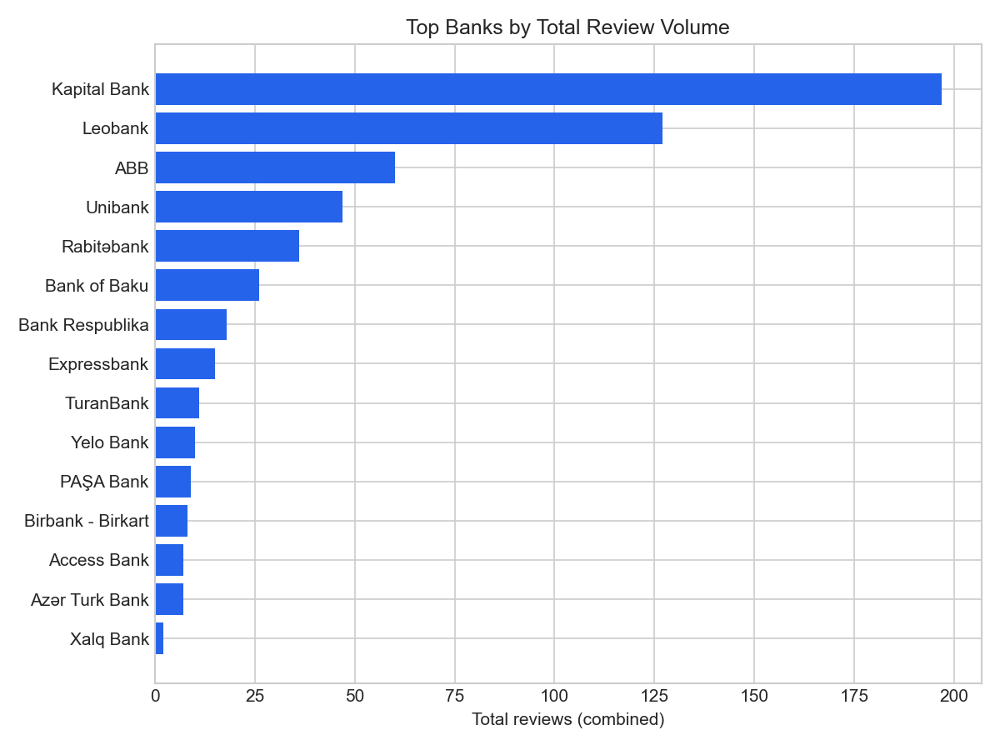
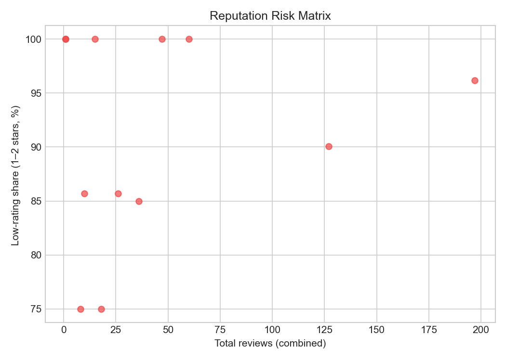
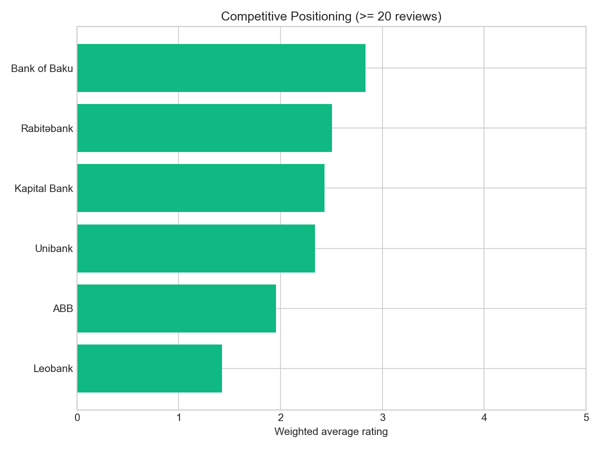
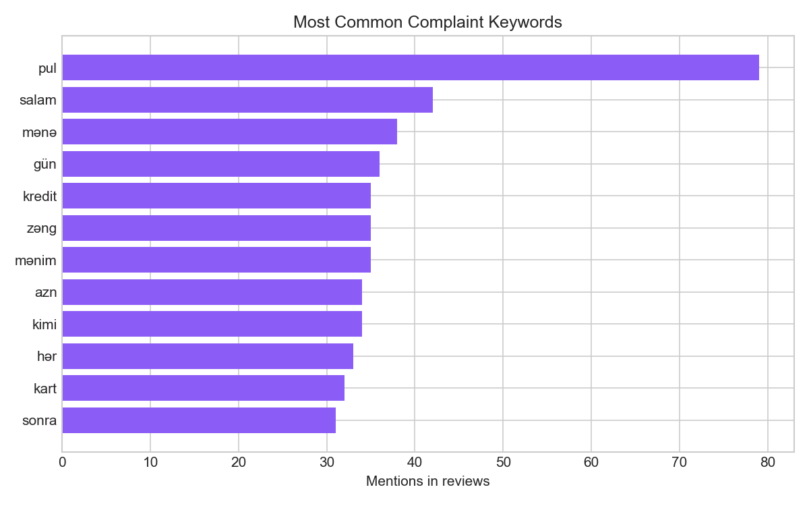

# Bank Review Insights

This report aggregates bank review data at the **company level** and focuses on business value: reputation risk, customer experience, and competitive positioning.

**Overview**
- Total banks with reviews: 22
- Banks represented in multiple datasets: 9
- Most reviewed bank: Kapital Bank (197 total reviews)
- Rating range (weighted average): 1.00 to 4.50
- Review volume concentration: top 3 banks account for 65.3% of all bank reviews

## 1. Review Volume Concentration

**What this means**
- The top three banks hold 65.3% of all reviews, so reputation swings are driven by a small set of brands.
- Prioritizing CX improvements in these banks yields the highest impact on overall market sentiment.

## 2. Reputation Risk (Scale vs Low-Rating Share)

**What this means**
- Banks in the upper-right of the chart combine **high review volume** with **high 1–2 star share**, signaling the highest reputation risk.
- Highest-risk banks by this dataset: Kapital Bank, Leobank, ABB, Unibank, Rabitəbank.

## 3. Competitive Positioning (Material Volume Only)

**What this means**
- Only banks with at least 20 reviews are compared to avoid small-sample bias.
- Rating leaders in this group: Bank of Baku, Rabitəbank, Kapital Bank, Unibank, ABB.

## 4. Customer Experience Pain Points

**What this means**
- Most frequent complaint keywords indicate recurring operational issues: pul, salam, mənə, gün, kredit.
- These themes are candidates for process fixes, policy updates, or frontline training.

---